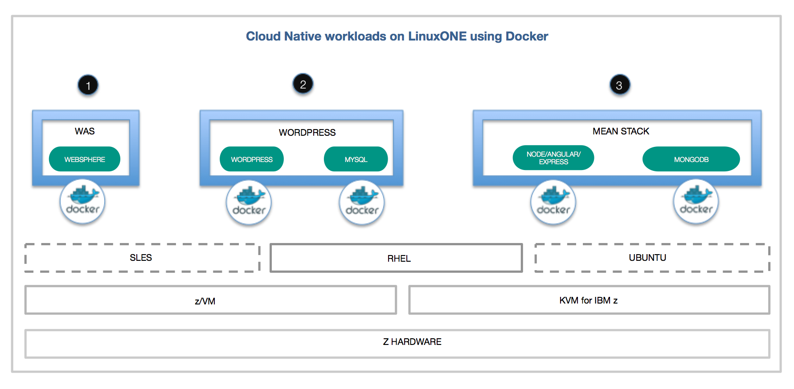
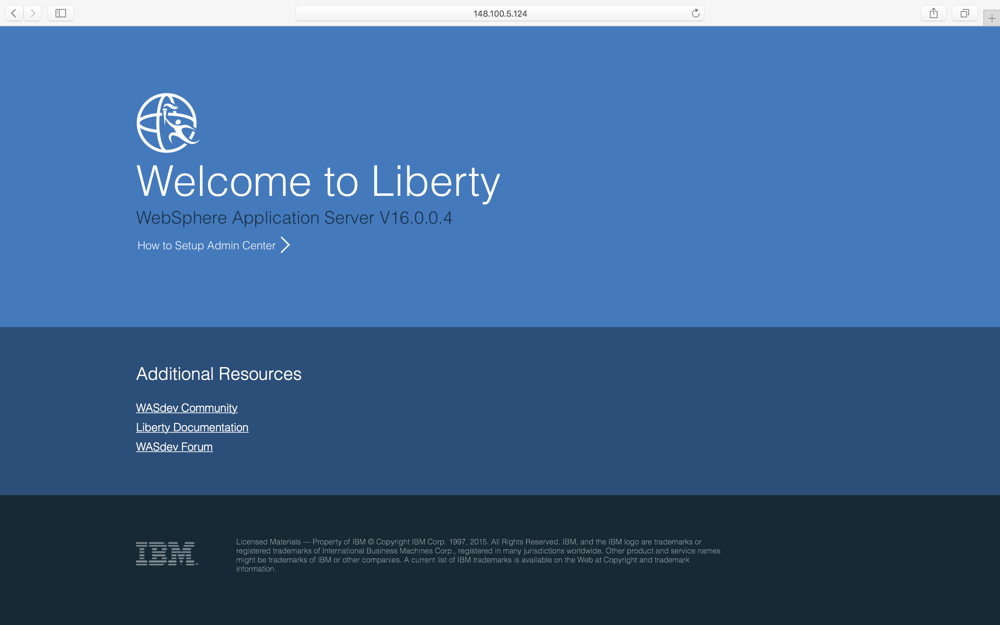
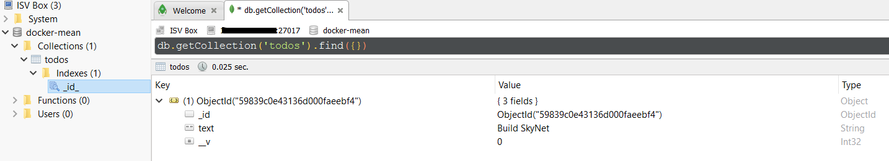

*他の言語で読む: [English](README.md).*

# Docker を使用して LinuxONE 上でオープンソースのクラウド・ネイティブのワークロードを構築して実行する

今やクラウド・ネイティブ・ソフトウェアを作成するにはオープンソースが主流の手法となっています。また、ほとんどのコンテナー・ベースのイノベーションは Docker が中心となって生まれています。このコード・パターンでは、このオープンソースとコンテナーからなる最新の開発エコシステムを、エンタープライズ・システム自体と、エンタープライズ・システムで重要視されるセキュリティー、成熟度、ハイパフォーマンスに適合させる方法を説明します。

LinuxONE はオープンソースのために構築されているため、業界で最も安全でスケーラブルで高性能な Linux サーバでオープンな革命を迅速に活用できます。今回のパターンでは、Docker を使って LinuxONE 上でオープンソースのクラウドネイティブのワークロードを実行する方法を紹介します。 Docker Hub からの既存の LinuxONE Docker イメージを、オープン・ソース・ワークロードのデプロイメントのためにそのまま使用する方法を示します。

必要なイメージが存在しない場合は、ワークロード用に独自のドッカーイメージを作成する方法も示します。zアーキテクチャは、分散環境で使用される典型的なマシンとは異なる命令セットを持っています。Dockerfile にネイティブコードを作成するビルドステップがある場合は、LinuxONE で使用できる特定のパッケージに加えて、コンパイルフラグに正しいプラットフォームを指定してLinuxONEで動作させる必要があります。このドキュメントの後半で、その詳細を説明します。



## シナリオ

[シナリオ 1: Docker Hub の Docker イメージを使用して LinuxONE 上でワークロードを実行する](#scenario-one-use-docker-images-from-docker-hub-to-run-your-workloads-on-linuxone)
1. [WebSphere Liberty をインストールして実行する](#1-install-and-run-websphere-liberty)
2. [WordPress をインストールして実行する](#2-install-and-run-wordpress)

[シナリオ 2: LinuxONE用の独自のDockerイメージを作成する](#scenario-two-create-your-own-docker-images-for-linuxone)
1. [独自の Application Base を作成する](#1-obtain-the-mean-stack-docker-components-from-github)

## 含まれるコンポーネント

- [LinuxONE](https://www.ibm.com/linuxone/open-source)
- [Docker](https://www.docker.com)
- [WordPress](https://wordpress.org/about/)
- [MEAN](https://mean.io/)
- [WebSphere Liberty](https://hub.docker.com/r/s390x/websphere-liberty/)
- [MEAN Stack](http://mean.io/)

## 前提条件

試用アカウントについて [LinuxONE Community Cloud](https://developer.ibm.com/linuxone/) に登録してください。今回のパターンでは Red Hat のベースイメージを使用しますので、このページの左側にある 'Request your trial (試用リクエスト)' ボタンを必ず使用してください。

<a name="scenario-one-use-docker-images-from-docker-hub-to-run-your-workloads-on-linuxone"></a>
## シナリオ 1: Docker Hub の Docker イメージを使用して LinuxONE 上でワークロードを実行する

[Docker Hub](https://hub.docker.com) には、すぐ使用できるイメージが幾つかあり、これを利用してコンテナを使い始める方が簡単です。 ['s390x'](https://hub.docker.com/search/?isAutomated=0&isOfficial=0&page=1&pullCount=0&q=s390x&starCount=0) タグで検索して、LinuxONE と互換性のあるイメージのリストを参照することができます.

以下の手順は、RHEL 7.3 の基本イメージを前提としています。

rootとして実行する必要があります:
```shell
$ sudo su -
```

### docker のインストール
まず、[このページ](https://www.ibm.com/developerworks/linux/linux390/docker.html) から正しい Docker パッケージアーカイブをダウンロードする必要があります。RHEL 7.3 のバージョン 1.11.2 の場合：

```shell
# wget ftp://ftp.unicamp.br/pub/linuxpatch/s390x/redhat/rhel7.3/docker-17.05.0-ce-rhel7.3-20170523.tar.gz
```

次に、アーカイブを解凍し、Docker バイナリをコピーします:
```shell
# tar -xzvf docker-17.05.0-ce-rhel7.3-20170523.tar.gz
# cp docker-17.05.0-ce-rhel7.3-20170523/docker* /usr/local/bin/
```

そして次に、Docker デーモンを起動します:
```shell
# docker daemon -g /local/docker/lib &
```
以下は出力結果の例です:
```shell
[root@devjourney07 ~]# docker daemon -g /local/docker/lib &
[1] 2332
[root@devjourney07 ~]# INFO[0000] New containerd process, pid: 2338

WARN[0000] containerd: low RLIMIT_NOFILE changing to max  current=1024 max=4096
WARN[0001] devmapper: Usage of loopback devices is strongly discouraged for production use. Please use `--storage-opt dm.thinpooldev` or use `man docker` to refer to dm.thinpooldev section.
INFO[0001] devmapper: Creating filesystem xfs on device docker-94:2-263097-base
INFO[0001] devmapper: Successfully created filesystem xfs on device docker-94:2-263097-base
INFO[0001] Graph migration to content-addressability took 0.00 seconds
INFO[0001] Firewalld running: false
INFO[0001] Default bridge (docker0) is assigned with an IP address 172.17.0.0/16. Daemon option --bip can be used to set a preferred IP address
INFO[0001] Loading containers: start.

INFO[0001] Loading containers: done.
INFO[0001] Daemon has completed initialization
INFO[0001] Docker daemon                                 commit=b9f10c9-unsupported graphdriver=devicemapper version=1.11.2
INFO[0001] API listen on /var/run/docker.sock
```

### docker-compose のインストール

依存関係をインストールします。

```shell
# yum install -y python-setuptools
```

easy_install を使用して pip をインストールする。

```shell
# easy_install pip
```

backports.ssl_match_hostname をアップグレードする。

```shell
# pip install backports.ssl_match_hostname --upgrade
```

最後に、docker-compose 自体をインストールする。
```shell
# pip install docker-compose
```

<a name="1-install-and-run-websphere-liberty"></a>
### 1. WebSphere Liberty をインストールして実行する

このステップでは、もう一度 Docker Hub の既存のイメージを使用します。今回は、WebSphere Application Server をセットアップします。Java EE 7 Full Platform 準拠の実装です。

#### 1. Docker Run

コンテナを実行してください (注：rootとしてログインする必要があります)

```shell
# docker run -d -p 80:9080 -p 443:9443 s390x/websphere-liberty:webProfile7
```

#### 2. Browse

サーバーが起動すると、`http://[LinuxOne Host IP]` でブラウズできます。



<a name="2-install-and-run-wordpress"></a>
### 2. WordPress をインストールして実行する

誰もが好きなデモ、WordPress のインストールを始めましょう。これらの手順では、RHEL 7.2 の基本イメージを想定しています。[こちら](https://github.com/IBM/Scalable-WordPress-deployment-on-Kubernetes/blob/master/docs/deploy-with-docker-on-linuxone.md#steps) の指示に従って LinuxOne に WordPress をインストールし、実行してください。

<a name="scenario-two-create-your-own-docker-images-for-linuxone"></a>
## シナリオ 2: LinuxONE用の独自のDockerイメージを作成する

シナリオ 1では、既に作成され使用を待っていた、Docker Hubコミュニティにある2つのコンテナイメージを使用しました。しかし、現時点で用意されていないワークロードを実行しようとしている場合はどうでしょうか？このシナリオでは、独自の Docker イメージを作成する手順を説明します。

<a name="1-obtain-the-mean-stack-docker-components-from-github"></a>
### 1. 独自の Application Base を作成する

MEANスタックは、最も一般的な OSS NoSQL DBである MongoDB から始まるいくつかのパッケージの組み合わせです。M*EAN* コンポーネントは、Express.js、Angular.js、Node.jsの略です。Node.js は JavaScript ランタイム、Express.js はサーバーフレームワーク、Angular.js は汎用の MVC/MVVNフレームワークです。この [ブログ](https://scotch.io/tutorials/creating-a-single-page-todo-app-with-node-and-angular) を出発点として使用します。このブログは、Angular.js/Express.js を初めてお使いの方にも便利です。

ベストプラクティスに基づいてMEANアプリケーション用にいくつかのフォルダ構造が提案されていますが、このユースケースでは、ソースブログと同様に、次のように単純化します。

```
base
-app (Express routes and MongoDB connections)
-config (MongoDB and other config parameters)
-public (Frontend : Angular.js code, index page etc)
```

簡単にするために、これらのファイルはすべて [express-server](files/mean-docker/express-server) フォルダに配置します。

このマルチコンテナアプリケーションを組み合わせるには、docker-compose ファイルも必要です。LinuxONE の docker-compose.yaml が他のプラットフォームと同じであることに注目してください。

```shell
version: '2' # specify docker-compose version

# Define the services/containers to be run
services:
  express: #name of the second service
    build: express-server # specify the directory of the Dockerfile
    ports:
      - "3000:3000" #specify ports forwarding
    links:
      - database

  database: # name of the third service
    image: mongo # specify image to build container from
    ports:
      - "27017:27017" # specify port forewarding
```

コードをコンテナに移行するには、Dockerfile を作成する必要があります。コンテナ内の ```/usr/src``` には、JavaScriptのソースコードが格納されます。Docker の基本知識があると仮定して、[Dockerfile](files/mean-docker/express-server/Dockerfile) の各ステップはカバーしません。

### 2. MongoDB と Node.js のための LinuxONE コンテナ

LinuxONE 上の Docker と他のプラットフォームの Docker との主な違いは、コンテナの前に ```s390x/``` 識別子を追加することです。例えば、ibmnode は s390x/ibmnode になります。時には ```s390/``` グループの下にイメージが存在しないことがあり、これを解決するためには、単純に ``s390x`` でコンテナ名を検索するだけで十分です。例えば ```s390x nodejs``` のように。今年後半に Docker の複数アーキテクチャのサポートが出てくるので、s390xタグの追加は一時的なものにすぎません。

### 3. LinuxONE 上で MEAN スタックを開始する

``docker-compose up`` を正常に実行した場合、端末は以下のように表示します:

```
$ sudo docker-compose up
Starting meandocker_database_1 ...
Starting meandocker_database_1 ... done
Starting meandocker_express_1 ...
Starting meandocker_express_1 ... done
Attaching to meandocker_database_1, meandocker_express_1
database_1  | note: noprealloc may hurt performance in many applications
```

そしてブラウザに ``http://[ip of machine]:8080`` を指定すると、以下が表示されます。


\* 私たちは(映画ターミネーターに出てくる SkyNet のような)人類を破滅させるAIの建設を黙認していませんが、そうすることに決めたならば、LinuxONE はその比類のないセキュリティ、I/O能力と稼働時間のため、最高のプラットフォームとなるかもしれませんね。

リストに項目を追加したり削除したりすると、MongoDB からデータを保存/消去することができるはずです。これには RoboMongo を使用しましたが、任意の MongoDB クライアントを使用することができます。



### 4. アプリケーションのカスタマイズ

アプリケーションのすべてのカスタマイズは [express-server](files/mean-docker/express-server/) フォルダで行うことができます。Angular.js (すなわち、ビューとコントローラー) の変更は [express-server/app](files/mean-docker/express-server/app/models) の中で実施し、Express.js (すなわち、モデルとAPIのルート) の変更は [express-server/public](files/mean-docker/express-server/public) の中で実施します。 そして ``docker-compose down`` と ``docker-compose up`` を実行して、新しいコードでMEANスタックを呼び出すだけです。 任意のプラットフォームでアプリケーション開発を行い、github にプッシュし、LinuxONE に引き出し、JavaScriptコードを変更することなくコンテナを起動することができます。

## トラブルシューティング

node.js アプリケーションをビルドする際に表示されるエラーは、チュートリアル完了時に発生する可能性のある非推奨または非推奨の npms バージョンの使用に起因する可能性があります。これを修正するには、F1アプリには [angular-client/package.json](https://github.com/gangachris/mean-docker/blob/master/angular-client/package.json) ファイルを、TODO アプリには [express-server/package.json](files/mean-docker/express-server/package.json) ファイルを修正してください。いくつかの npms は下位互換性がないため、Node.js v6 の互換性を確認してください。

コンテナが互いに通信できない場合は、Docker デーモンを再起動する必要があります。``top`` を使ってデーモンのPIDを見つけ、`` kill -9`` でプロセスを終了してから、再び Docker デーモンを起動してください。

コンテナを docker-compose なしで起動すると、以下のようなエラーメッセージが表示されます。docker-compose は、コンテナネットワークを互いにアクセスできるようにリンクします。それは正しい接続情報を変数にセットします。この問題を解決するには、mean-docker フォルダ内で docker-compose を開始してください。

```
MongoError: failed to connect to server [database:27017] on first connect [MongoError: getaddrinfo ENOTFOUND database database:27017]
    at Pool.<anonymous> (/usr/src/node_modules/mongodb-core/lib/topologies/server.js:328:35)
    at emitOne (events.js:96:13)
    at Pool.emit (events.js:188:7)
    at Connection.<anonymous> (/usr/src/node_modules/mongodb-core/lib/connection/pool.js:280:12)
    at Connection.g (events.js:292:16)
    at emitTwo (events.js:106:13)
    at Connection.emit (events.js:191:7)
    at Socket.<anonymous> (/usr/src/node_modules/mongodb-core/lib/connection/connection.js:177:49)
    at Socket.g (events.js:292:16)
    at emitOne (events.js:96:13)
    at Socket.emit (events.js:188:7)
    at connectErrorNT (net.js:1021:8)
    at _combinedTickCallback (internal/process/next_tick.js:80:11)
    at process._tickCallback (internal/process/next_tick.js:104:9)
```

以下のエラーは、以前実行した MongoDB インスタンスがポートを占有していることを意味します。 ``docker-compose down`` からの ``docker-compose up`` や、 ``docker kill [donger psで調べたmongoコンテナのid]`` などを実行します。

```
Starting meandocker_database_1 ...
Starting meandocker_database_1 ... error

ERROR: for meandocker_database_1  Cannot start service database: driver failed programming external connectivity on endpoint meandocker_database_1 (93572e7c501c4acddc95740d079c60b199f2a554f
1fa56565e7a8e28fca686fe): Bind for 0.0.0.0:27017 failed: port is already allocated

ERROR: for database  Cannot start service database: driver failed programming external connectivity on endpoint meandocker_database_1 (93572e7c501c4acddc95740d079c60b199f2a554f1fa56565e7a8e
28fca686fe): Bind for 0.0.0.0:27017 failed: port is already allocated
ERROR: Encountered errors while bringing up the project.
```

# ライセンス
[Apache 2.0](LICENSE)
